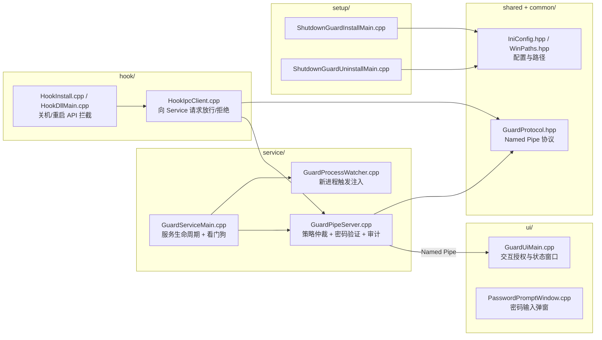

# ShutdownGuard — 企业关键主机关机/重启/睡眠防护组件

防止 Windows 业务主机被误操作关机、重启、睡眠或休眠。适用于银企直连客户端等需要长期在线运行的企业现场。

本方案不是通用安全软件，而是「防手滑/防违规/可追责」的企业现场防护层。

---

## 目录

- [架构概览](#架构概览)
- [编译](#编译)
- [安装](#安装)
- [使用方式](#使用方式)
- [配置参考](#配置参考)
- [卸载](#卸载)
- [程序行为详解](#程序行为详解)
- [磁盘文件布局](#磁盘文件布局)
- [注意事项与限制](#注意事项与限制)
- [紧急恢复](#紧急恢复)

---

## 程序源代码架构图



## 二进制程序架构概览

```
┌────────────────────────────────────────────────────────────┐
│                        企业电脑                              │
│                                                             │
│  ShutdownGuard.exe            ShutdownGuardHook.dll         │
│  (Windows Service)            (注入到 explorer / cmd 等)     │
│  ┌──────────────────┐         ┌──────────────────────┐      │
│  │ 策略仲裁中心      │◄═══════►│ API 拦截层            │      │
│  │ 密码验证          │ Named   │ 拦 ExitWindowsEx 等   │      │
│  │ 维护令牌管理      │ Pipe    │ 12 个关机相关 API     │      │
│  │ 审计日志          │         └──────────────────────┘      │
│  │ 看门狗           │                                       │
│  └────────┬─────────┘                                       │
│           │ Named Pipe                                      │
│           ▼                                                 │
│  ShutdownGuardUI.exe          ShutdownGuardInjector.exe     │
│  ┌──────────────────┐         ┌──────────────────────┐      │
│  │ 密码弹窗 (GUI)    │         │ 将 Hook DLL 注入到    │      │
│  │ 安装/卸载入口     │         │ 目标进程              │      │
│  └──────────────────┘         └──────────────────────┘      │
└────────────────────────────────────────────────────────────┘
```

### 为什么必须有守护进程和看门狗

- **服务是唯一策略中心**：所有放行/拒绝都在 `ShutdownGuard.exe` 决策，避免 UI、Hook、脚本各自判定导致逻辑分叉。
- **防止保护能力自然衰减**：UI 或 Injector 被结束后，看门狗会自动拉起，避免“保护组件掉线但无人发现”。
- **应对新进程持续出现**：`cmd/powershell/schtasks` 等会不断新开，仅一次注入不够；看门狗 + 进程观察线程负责持续补注入。
- **贴合现场运维现实**：单人维护场景下，必须靠系统自恢复而不是靠人盯进程列表。

共 6 个产出文件：

| 文件 | 类型 | 说明 |
|------|------|------|
| `ShutdownGuard.exe` | Windows 服务 | 常驻后台，策略中心、审计、看门狗 |
| `ShutdownGuardUI.exe` | GUI 程序 | 密码弹窗、安装/卸载引导 |
| `ShutdownGuardHook.dll` | 注入用 DLL | 拦截关机/重启 API |
| `ShutdownGuardInjector.exe` | 命令行工具 | 将 Hook DLL 注入目标进程 |
| `ShutdownGuardInstall.exe` | 命令行工具 | 命令行安装程序 |
| `ShutdownGuardUninstall.exe` | 命令行工具 | 命令行卸载程序 |

---

## 编译

### 环境需求

- CMake 3.20+
- MinGW-w64 (GCC) 或 MSVC
- 网路连线（首次编译自动下载 MinHook v1.3.4）

### 编译步骤

```bat
REM 将 cmake 和 mingw 加入 PATH
set PATH=你的CMAKE路径\bin;你的MINGW路径\bin;%PATH%

cd /d "项目根目录"

REM 配置（MinGW）
cmake -B build -G "MinGW Makefiles" -DCMAKE_BUILD_TYPE=Release

REM 编译
cmake --build build --config Release -j%NUMBER_OF_PROCESSORS%
```

如果使用 MSVC：

```bat
cmake -B build -G "Visual Studio 17 2022" -A x64
cmake --build build --config Release
```

### 编译后验证

确认产出的 DLL 和 EXE 不依赖 MinGW runtime：

```bat
objdump -p build\ShutdownGuardHook.dll | findstr /i "DLL Name"
```

结果应只包含系统 DLL（`KERNEL32.dll`、`ADVAPI32.dll`、`SHELL32.dll`、`bcrypt.dll` 等）。
**不应出现** `libstdc++-6.dll`、`libgcc_s_seh-1.dll`、`libwinpthread-1.dll`。

---

## 安装

> **前提：必须以系统管理员身份执行。**

### 一键安装（推荐）

1. 将编译产出的 6 个文件 + `install.bat` 拷贝到目标机的**同一个文件夹**
2. **右键 `install.bat` → 以管理员身份运行**
3. 按提示设定维护密码（输入两次确认）
4. 脚本自动完成所有安装步骤

安装程序会自动完成以下工作：

- 将 6 个档案复制到 `C:\Program Files\ShutdownGuard`
- 注册 Windows 服务（自动启动 + 故障自动重启）
- 设定安装目录 ACL（防止普通用户/管理员随手删除）
- 建立登入排程任务（自动启动 UI 和 Injector）
- 备份密码杂凑到独立目录（防 config 误删后无法卸载）
- 启动服务、注入器、UI 守护

### 进阶参数（手动安装）

如需自定义安装目录或跳过某些步骤，可直接调用安装程序：

| 参数 | 说明 |
|------|------|
| `--password-stdin` | 从标准输入读取密码 |
| `--dir "路径"` | 自定义安装目录（默认 `C:\Program Files\ShutdownGuard`） |
| `--start-service` | 安装完成后立即启动服务 |
| `--no-acl` | 跳过 ACL 权限加固（仅测试用） |
| `--no-schtasks` | 不建立登入排程任务 |

### 部署到其他机器

将本机编译好的 6 个文件 + `install.bat`（及卸载时用的 `uninstall.bat`）拷贝到**另一台机器**同一文件夹后：

1. **批次档编码**：`install.bat` 务必保存为 **UTF-8、CRLF 换行**。若目标机执行时出现「xxx is not recognized as an internal or external command」，多半是文件在拷贝或编辑时变成 UTF-8 without BOM、或换行变成 LF，导致 CMD 把某行中文当成命令执行。请用记事本或 VS Code 另存为「UTF-8」并确认换行为 Windows (CRLF)。
2. **错误代码 -1073741819**：表示安装程式 `ShutdownGuardInstall.exe` 发生存取违规 (0xC0000005)。请确认：目标机为 **64 位元 Windows**、杀毒/安全软体未拦截或隔离该 exe；可尝试在目标机直接运行 `ShutdownGuardInstall.exe --help` 或 `ShutdownGuardInstall.exe --password-stdin --start-service`（再从本机输入密码）以确认是否能正常执行。
3. **编译机与目标机**：本专案用 MinGW 静态连结，产出的 exe 不依赖 `libstdc++-6.dll` 等；只要把 `build\` 下的 6 个档案拷贝过去即可，**无需**在目标机安装 CMake 或 MinGW。
4. **安装/卸载程式为 GUI 子系统**：因 MinGW 连结器行为，`ShutdownGuardInstall.exe` / `ShutdownGuardUninstall.exe` 以 WinMain 进入、属 GUI 子系统，从 cmd 执行时不会有主控台视窗，stdin 重定向也不可靠。因此批次档请用 **`--password-file`** 传密码；执行 **`--help`** 会弹出说明视窗而非在 cmd 显示。

---

## 使用方式

### 日常运行（安装完成后）

安装完毕后，系统开机时：

1. **服务自动启动**（`ShutdownGuard.exe` 作为 Windows Service）
2. **看门狗**每 5 秒检查 UI 是否在运行，不在则自动拉起
3. **看门狗**每 60 秒自动执行 Injector，确保 Hook DLL 注入到目标进程

正常情况下无需人工干预。

### 有人尝试关机时

1. 有人点「关机」或敲 `shutdown /s` → Hook DLL 在 API 层拦截
2. Hook 透过命名管道向 Service 请求仲裁
3. Service 判断：是否在维护视窗内？
4. **不在维护视窗** → 进入交互验证流程
5. **授权密码阶段**：最多 3 次；通过即放行
6. **维护密码阶段**：若授权密码连续错误 3 次，切换到维护密码，最多再 3 次
7. 若两阶段都失败，进入系统自我保护冷却（默认 300 秒）
8. 冷却期间：**不再弹密码框、所有关机/重启一律拦截**
9. 命令行路径（`cmd/powershell`）会显示：`[ShutdownGuard] 系统自我保护中，请在 X分Y秒 后重试`
10. 所有行为记入审计日志

### 合法维护流程

1. 维护人员触发关机 → 弹出密码框
2. 优先输入授权密码（可直接放行）
3. 若授权密码连续错误 3 次，可转为输入维护密码
4. 任一密码验证通过后，系统放行并开启维护视窗（预设 300 秒 = 5 分钟）
5. 维护视窗内同机后续关机/重启不再重复输入密码
6. 维护视窗过期后恢复保护

### 两种密码（安装/卸载 vs 授权）

- **安装/卸载密码**（维护密码）：用于安装、卸载服务；由安装时或 `--set-password` 设定，并备份到 `ToolsDir` 供卸载验证。
- **授权密码**：用于放行被拦截的关机/重启（默认优先验证）。当授权密码连续错误达到阈值后，会进入维护密码回退验证阶段。

修改安装/卸载密码：

```bat
ShutdownGuardUI.exe --set-password
```

设定授权密码（与安装/卸载密码分开）：

```bat
ShutdownGuardUI.exe --set-auth-password
```

- **若尚未设过授权密码**：会弹出两次密码框（输入新密码 + 确认）。
- **若已存在授权密码**：会先提示输入当前授权密码，验证通过后才允许输入新密码；验证失败则拒绝修改。

### 观察模式（可选）

Hook 只拦截关机/重启相关的 API 调用，不影响任何正常程序（包括银行客户端）的运行。
一般场景下可以直接 `Mode=block` 上线，无需观察期。

如果你的环境有特殊软件或排程脚本会调用 `shutdown.exe`，可以先用观察模式排查：

```ini
[General]
Mode=observe
```

观察模式下，Hook 仍然工作并记录日志，但**不会拦截任何操作**。

---

## 配置参考

配置档位置：`C:\ProgramData\ShutdownGuard\guard.ini`

```ini
[General]
; 工作模式：observe = 只记录不拦截 | block = 拦截+要密码
Mode=block

[Behavior]
; Hook 等待 Service 仲裁的超时时间（毫秒），超时则拒绝
HookTimeoutMs=10000
; Service 不可达时是否拒绝关机（1=拒绝, 0=放行）
; 建议正式环境设 1（宁可麻烦维护，也别被关机）
; 卸载时会自动设为 0 以防死锁
DenyIfServiceDown=1
; 两阶段密码（授权 3 次 + 维护 3 次）都失败后，进入自我保护冷却时间（秒）
; 冷却期内不弹密码框，且一律拦截
AuthLockSeconds=300

[Auth]
; 密码验证后维护令牌有效时间（秒）
TokenSeconds=300
; 安装/卸载密码（维护密码）
Iterations=200000
SaltHex=...
HashHex=...
; 授权密码（放行关机/重启用；若未设定则以 HashHex 验证）
; AuthTokenSaltHex=...
; AuthTokenHashHex=...
; AuthTokenIterations=200000

[Watchdog]
; 看门狗开关（1=启用, 0=停用）
Enabled=1
; 看门狗检查间隔（毫秒）
IntervalMs=5000
; Injector 定期重跑间隔（毫秒）
InjectorEveryMs=60000

[Injection]
; Hook DLL 路径（预设与 Injector 同目录）
DllPath=
; 注入目标进程列表（分号分隔）
Targets=explorer.exe;cmd.exe;powershell.exe;pwsh.exe;shutdown.exe;schtasks.exe;WmiPrvSE.exe;RuntimeBroker.exe;rundll32.exe

[Install]
; 以下由安装程序自动写入
InstallDir=C:\Program Files\ShutdownGuard
ToolsDir=C:\ProgramData\ShutdownGuardTools
InstallDirAclBackup=...
UninstallExe=...

[Power]
; 以下由安装程序自动写入（原始电源策略值，卸载时还原）
PolicyModified=1
OriginalStandbyAC=1800
OriginalHibernateAC=3600
OriginalShowSleep=1
```

---

## 卸载

> **卸载需要维护密码。没有密码无法卸载。**

### 一键卸载（推荐）

将 `uninstall.bat` 拷贝到目标机，**右键 → 以管理员身份运行**，输入密码即可。

卸载程序会自动完成：

1. 验证维护密码
2. **停止模式**：`DenyIfServiceDown=0`、`UninstallAllowAll=1`，并通知服务停止注入器（一律放行）
3. **解除注入**：结束所有载有 Hook DLL 的进程（含 WmiPrvSE、explorer、cmd 等）
4. 结束 UI/Injector 进程，停止并删除 Windows 服务
5. 恢复安装目录 ACL，删除安装目录与 `C:\ProgramData\ShutdownGuard`
6. 若目录仍被占用，则**登记为「重启后删除」**（`MoveFileEx` 延迟删除）；重启后系统自动清理
7. 还原睡眠/休眠策略（`powercfg` + 注册表）
8. 自行删除卸载程式和 Tools 目录（或排程退出后删除）

若出现「部分目录已登记为重启后删除」，属正常；防护已解除，**当前不影响系统使用**，重启即可彻底清理。详见 **[UNINSTALL_STATE.md](UNINSTALL_STATE.md)**（卸载状态、残留说明、一键恢复步骤）。

### 其他卸载方式

- **UI 卸载**：运行 `ShutdownGuardUI.exe --uninstall`，弹出密码框验证后自动卸载
- **应急卸载**：见下方「紧急恢复」章节

---

## 程序行为详解

### 拦截的 API（共 14 个）

| API | 来源 DLL | 触发场景 |
|-----|---------|---------|
| `ExitWindowsEx` | user32.dll | 开始菜单「关机」「重启」「注销」 |
| `InitiateShutdownW` | advapi32.dll | 程序化关机调用 |
| `InitiateShutdownA` | advapi32.dll | 同上（ANSI 版） |
| `InitiateSystemShutdownExW` | advapi32.dll | 远程/本地关机 |
| `InitiateSystemShutdownExA` | advapi32.dll | 同上（ANSI 版） |
| `InitiateSystemShutdownW` | advapi32.dll | 旧式关机 API |
| `InitiateSystemShutdownA` | advapi32.dll | 同上（ANSI 版） |
| `NtShutdownSystem` | ntdll.dll | 底层核心关机呼叫 |
| `NtSetSystemPowerState` | ntdll.dll | 未公开 API：关机/断电/睡眠/休眠等电源状态 |
| `SetSuspendState` | powrprof.dll | 程序化睡眠/休眠调用 |
| `CreateProcessW` | kernel32.dll | 侦测启动 `shutdown.exe` |
| `CreateProcessA` | kernel32.dll | 同上（ANSI 版） |
| `ShellExecuteExW` | shell32.dll | 侦测 ShellExecute 启动 `shutdown.exe` |
| `ShellExecuteExA` | shell32.dll | 同上（ANSI 版） |

### 电源策略调整

安装时自动执行以下策略变更（卸载时还原）：

| 策略 | 安装后 | 卸载后还原 |
|------|--------|-----------|
| AC 待机超时 | 0（永不睡眠） | 还原原始值 |
| AC 休眠超时 | 0（永不休眠） | 还原原始值 |
| 休眠功能 | 关闭（`powercfg /hibernate off`） | 开启 |
| 开始菜单「睡眠」按钮 | 隐藏 | 显示 |

### 关机命令侦测逻辑

对 `CreateProcess` / `ShellExecuteEx` 路径，程序会解析命令行判断是否为「关机类」操作：

- 程序名为 `shutdown.exe` 且带有 `/s`、`/r`、`/p`、`/g`、`/sg`、`/hybrid`、`/fw`、`/o`、`/h` → **拦截**
- `shutdown /a`（取消关机） → **不拦截**
- `cmd.exe /c shutdown /s ...` 的间接调用 → **拦截**
- PowerShell `Stop-Computer` / `Restart-Computer` → **拦截**（WmiPrvSE.exe 已被注入）
- `wmic os call shutdown` → **拦截**（同上）
- `rundll32.exe powrprof.dll,SetSuspendState` → **拦截**（rundll32.exe 已被注入 + SetSuspendState 已被 Hook）
- 非关机命令（如 `notepad.exe`） → **直接放行，不询问服务**

### 自我保护机制

| 机制 | 说明 |
|------|------|
| 服务故障自动重启 | SCM Recovery：1 秒 → 5 秒 → 10 秒 |
| 看门狗拉起 UI | UI 被杀后 5 秒内自动重启 |
| 看门狗拉起 Injector | 每 60 秒重跑，确保新进程也被注入 |
| UI 重启限速 | 每分钟最多重启 3 次，超过后冷却 30 秒（防崩溃循环） |
| 安装目录 ACL | SYSTEM 完整控制；管理员只读+执行（无法删除/改权限）；普通用户无写入权限 |
| 安装/卸载密码 | 安装、卸载时验证；可与授权密码分开 |
| 授权链路 | 授权密码最多 3 次，随后维护密码最多 3 次 |
| 密码错误冷却 | 两阶段都失败后触发冷却（`AuthLockSeconds`），期间不弹窗且一律拦截 |
| `DenyIfServiceDown=1` | 即使手动停止服务，Hook 仍拒绝关机 |
| 密码哈希备份 | 安装/卸载密码备份到 `ToolsDir`，即使 `guard.ini` 被误删仍可验证卸载 |
| 单实例控制 | Global Mutex 防止多个 UI 进程冲突 |

### 密码安全

- 密码以 **PBKDF2-SHA256** 哈希后储存，不储存明文
- 16 字节随机盐值
- 默认 200,000 次迭代
- 验证使用恒定时间比较（防计时攻击）

### 日志

所有日志位于 `C:\ProgramData\ShutdownGuard\logs\`：

| 日志文件 | 内容 |
|----------|------|
| `service.log` | 服务端策略决策、维护令牌发放 |
| `service_main.log` | 服务启停、看门狗操作 |
| `hook.log` | Hook 拦截记录（BLOCK/ALLOW） |
| `hook_ipc.log` | Hook ↔ Service IPC 通讯 |
| `ui.log` | UI 操作、密码验证 |
| `injector.log` | DLL 注入结果 |
| `install.log` | 安装过程记录 |
| `uninstall.log` | 卸载过程记录 |

每条日志格式：`[YYYY-MM-DD HH:MM:SS.mmm] 内容`

---

## 磁盘文件布局

安装后在目标机上的文件结构：

```
C:\Program Files\ShutdownGuard\          ← 安装目录（ACL 保护）
├── ShutdownGuard.exe                    ← Windows 服务
├── ShutdownGuardUI.exe                  ← 密码弹窗 GUI
├── ShutdownGuardInjector.exe            ← DLL 注入器
└── ShutdownGuardHook.dll                ← Hook DLL

C:\ProgramData\ShutdownGuard\            ← 运行时数据
├── guard.ini                            ← 配置文件
├── install_dir_acl.sddl                 ← 安装目录原始 ACL 备份
└── logs\                                ← 日志目录
    ├── service.log
    ├── service_main.log
    ├── hook.log
    ├── hook_ipc.log
    ├── ui.log
    ├── injector.log
    ├── install.log
    └── uninstall.log

C:\ProgramData\ShutdownGuardTools\       ← 工具目录（安装目录外，避免自锁）
├── ShutdownGuardUninstall.exe           ← 卸载程序
└── auth_backup.ini                      ← 密码哈希备份（隐藏）
```

Windows 服务名称：`ShutdownGuard`
命名管道：`\\.\pipe\ShutdownGuard\HookToService`、`\\.\pipe\ShutdownGuard\ServiceToUi`

---

## 注意事项与限制

### 本方案能做到

- 拦截绝大多数「点按钮/敲命令」的低成本关机/重启/睡眠/休眠操作
- 关机/重启/睡眠/休眠需要密码授权
- 安装时自动禁用系统睡眠和休眠策略
- 完整审计日志（谁、什么时候、用什么方式、结果如何）
- 卸载需要密码，防止随手移除保护
- 服务自动恢复，提高「先停保护再关机」的成本

### 本方案无法阻止

- 物理断电、拔插头、长按电源键
- 硬件故障、蓝屏、系统崩溃
- 安全模式下篡改（服务不会自动启动）
- 蓄意且具备技术能力的管理员绕过（如：安全模式删除 → 重启）

### 上线前必做

1. 将维护密码**记录在安全的地方**，遗忘密码只能通过物理断电进安全模式恢复
2. 建议启用 Windows 进程建立审计策略（事件 ID 4688 + 命令行），增强证据链
3. 如有特殊计划脚本会调用 `shutdown.exe`，可先用观察模式（`Mode=observe`）排查

### 注入对象说明

默认注入目标：`explorer.exe`、`cmd.exe`、`powershell.exe`、`pwsh.exe`、`shutdown.exe`、`schtasks.exe`、`WmiPrvSE.exe`、`RuntimeBroker.exe`、`rundll32.exe`

- Hook DLL 只拦截关机相关操作，不影响进程的其他功能
- 注入器每 60 秒重跑一次，新启动的进程也会被注入
- 可在 `guard.ini` 的 `[Injection] Targets` 中调整注入目标
- `shutdown /a`（取消关机）不会被拦截

---

## 紧急恢复

> **重要**：由于关机和重启都被拦截，进入安全模式必须**物理断电**：
>
> 1. **长按电源键 5 秒**强制关机
> 2. 重新开机，反复按 **F8**（或在启动画面出现前连续断电 3 次触发 WinRE）
> 3. 选择「**安全模式**」或「**带命令提示符的安全模式**」

### 方法一：使用内置应急后门（推荐）

进入安全模式后，在安装包目录以管理员身份运行：

```bat
ShutdownGuardInstall.exe --emergency-reset
```

该命令会直接调用卸载程序的应急免密分支，执行“恢复到未安装状态”（服务、任务、目录、策略恢复）。

### 方法二：手动操作（安全模式下）

1. 修改 `C:\ProgramData\ShutdownGuard\guard.ini`：

```ini
[Behavior]
DenyIfServiceDown=0

[General]
Mode=observe
```

2. 禁用或删除服务：

```bat
sc config ShutdownGuard start= disabled
:: 或直接删除
sc delete ShutdownGuard
```

3. 正常重启即可

### 方法三：记得密码时的最小维护（不含卸载）

当 `ShutdownGuardInstall.exe` 和 `ShutdownGuardUninstall.exe` 都丢失时，
可通过服务本体的两个开关执行最小维护（仅停用/恢复，不执行卸载）：

```bat
REM 需“以管理员身份”执行；执行时会要求输入维护密码
REM 1) 停用服务 + 放开安装目录 ACL（管理员可修改/可删除）
ShutdownGuard.exe --disable-service

REM 2) 启用服务 + 锁定安装目录 ACL（管理员不可删除/不可修改 ACL）
ShutdownGuard.exe --enable-service
```

参数说明：
- `--disable-service`：将防护切换为停用状态（`Mode=observe`、`DenyIfServiceDown=0`），并禁用服务启动项
- `--enable-service`：将防护恢复为启用状态（`Mode=block`、`DenyIfServiceDown=1`），并重新启用服务

接着手动处理目录

### 方法四：密码遗忘

必须物理断电进入安全模式：

1. 删除 `C:\ProgramData\ShutdownGuard\guard.ini` 中的 `SaltHex` 和 `HashHex` 行
2. 同时删除 `C:\ProgramData\ShutdownGuardTools\auth_backup.ini`
3. 正常重启后用 `ShutdownGuardUI.exe --set-password` 设置新密码

---

## 授权

本项目为企业内部使用的专用工具。
